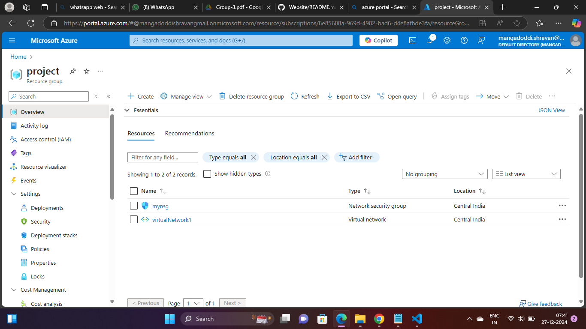
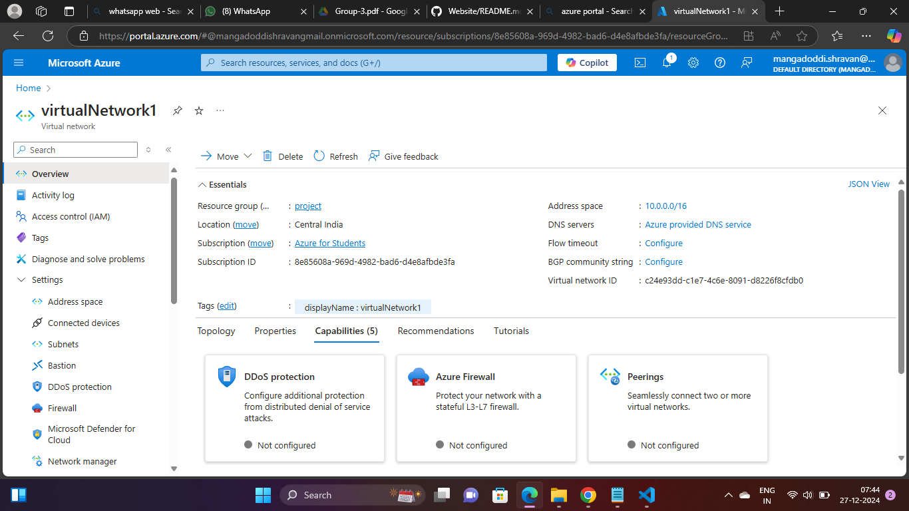
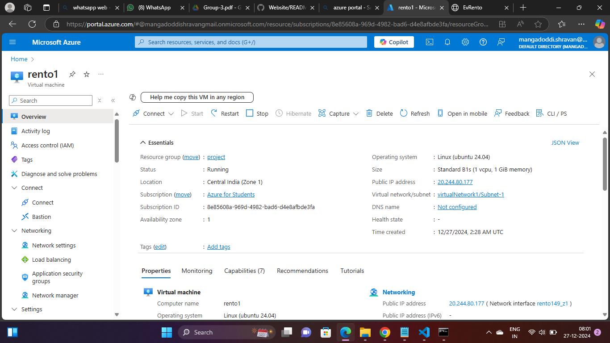
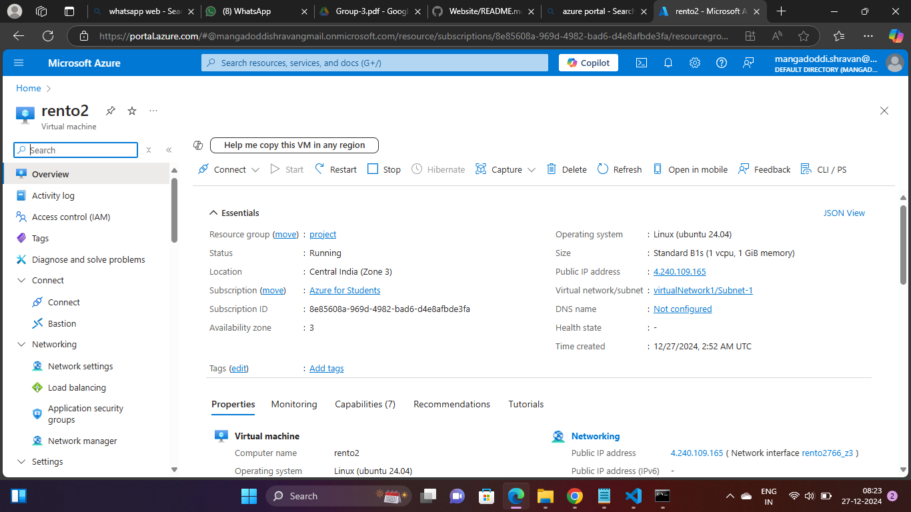
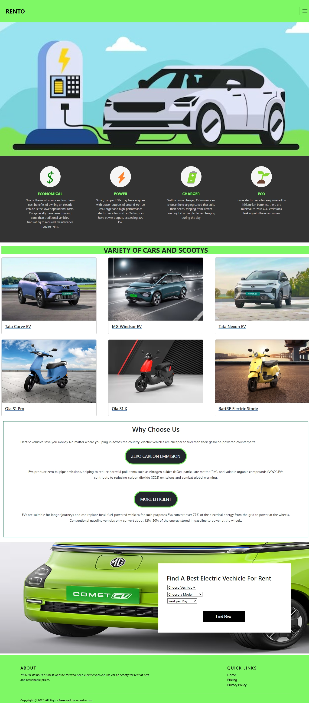
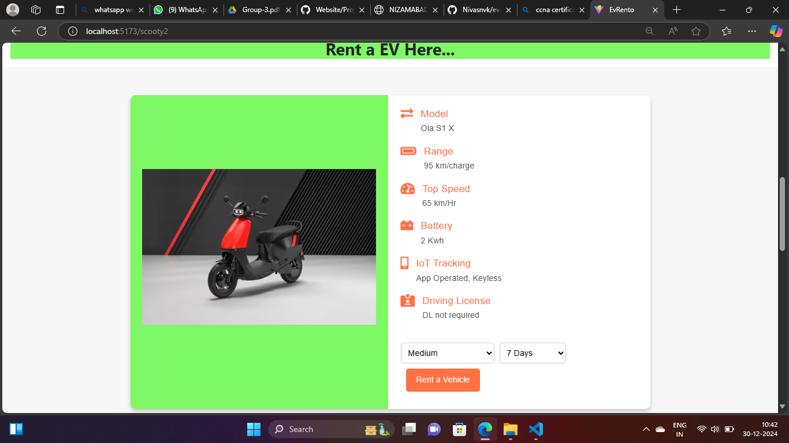
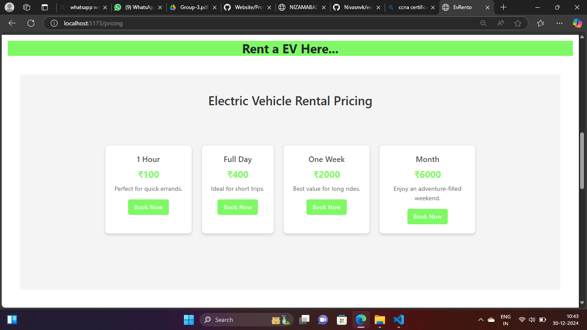

# Deploying Static Website using Load Balancer by ARM Template

## Project Overview

**RENTO Website** An Electric Vehicle (EV) Rental Website is an innovative platform designed to promote sustainable transportation by providing users with an easy way to rent electric vehicles for personal or commercial use. The website typically features a user-friendly interface where customers can browse through a variety of electric vehicles, including cars, bikes, and scooters, with detailed descriptions such as battery range, charging options, and pricing.

This project demonstrates the deployment of **RENTO Website** using Azure's ARM templates and load balancing across two Virtual Machines (VMs) in different availability zones for high availability and scalability. 

## Problem Statement

In an era where air pollution is on the rise and natural resources like petrol and diesel are being rapidly depleted, adopting sustainable solutions has become a pressing need. The concept of electric vehicle (EV) rentals serves as a significant step toward addressing these challenges. Traditional vehicles powered by fossil fuels are one of the leading contributors to air pollution, releasing harmful emissions like carbon dioxide, nitrogen oxides, and particulate matter into the atmosphere. This not only deteriorates air quality but also contributes to global warming and health problems. Additionally, the excessive reliance on finite resources like petrol and diesel is unsustainable, with reserves dwindling at an alarming rate due to overconsumption.

Electric vehicles, on the other hand, offer a clean and efficient alternative. By running on electricity, they produce zero tailpipe emissions, significantly reducing the carbon footprint associated with transportation. This shift can help combat the adverse effects of climate change and improve air quality in urban areas. Moreover, the use of renewable energy sources like solar or wind to charge EVs further enhances their eco-friendliness, making them a viable long-term solution.

The introduction of an EV rental platform amplifies this impact by making electric vehicles more accessible to the public. Such platforms encourage people to adopt eco-friendly modes of transportation without the financial burden of owning an EV. Users can conveniently rent vehicles for their specific needs, whether for a short commute or a longer trip, and contribute to a greener future with every ride. By integrating technology, these platforms not only simplify the rental process but also foster awareness and acceptance of sustainable transportation, ultimately driving a collective effort toward reducing pollution and conserving natural resources.

## Project Goals

- Deploy the **RENTO Website** website on Azure using ARM templates.
- Set up a **Virtual Network (VNet)** with two **Subnets** and a **Network Security Group (NSG)**.
- Use a **Load Balancer** to distribute traffic between two VMs located in different availability zones.
- Host the static website on these VMs and make it accessible via the load balancer's frontend IP.

## Technnologies used develop this Rento Website

-HTML, CSS, JavaScript, REACT JS Library.

## Technologies and Azure Services Used

1. **Azure CLI**: Used to create the resource group and Virtual Network.
2. **ARM Templates**: Automated the creation of VNet, subnets, and NSG.
3. **Azure Virtual Machines (VMs)**: Hosted the RENTO website.
4. **Azure Load Balancer**: Distributed the traffic between two VMs to ensure high availability.
5. **Nginx**: Used as a web server on both VMs to serve the static content.
6. **Git**: Cloned the website from GitHub onto the VMs using a custom script.
7. **Custom Script Extension**: Used to automatically configure the VMs upon deployment.

## Project Steps

### 1. Website Development
- **RENTO Website**: An Electric Vehicle Rental Website is a platform that allows users to conveniently rent eco-friendly electric vehicles, promoting sustainable transportation and 
reducing carbon emissions. It provides easy booking, secure payments, and access to nearby charging stations for a seamless rental experience.

### 2. Deploying the Website on GitHub
- The frontend of **RENTO Website** was uploaded to a public GitHub repository: [Rento Website](https://github.com/Nivasnvk/evrent.git).

### 3. Azure Deployment Using ARM Templates
- **Resource Group**: Created using Azure CLI to hold all the resources.
- **Virtual Network (VNet)**: Set up using an ARM template, which included two subnets for distributing the VMs.
- **Network Security Group (NSG)**: Applied inbound rules to allow traffic on ports 22 (SSH) and 80 (HTTP).
  
### 4. Virtual Machines Setup
- **VM 1**: Created in Availability Zone 1 using Azure Portal. Configured with:
  - Custom Script Extension to clone the website from GitHub.
  - Networking settings to connect to the VNet and assigned Subnet.
  
  Custom Script:
  ```bash
  #!/bin/bash
  sudo apt update
  sudo apt install nginx git -y
  cd /tmp && git clone https://github.com/Nivasnvk/evrent.git mysitee
  sudo rm -rf /var/www/html/index.nginx-debian.html
  sudo cp -r /tmp/mysitee/* /var/www/html/
  ```

- **VM 2**: Created in Availability Zone 3 with the same configuration as VM 1.

### 5. Load Balancer Configuration
- **Load Balancer**: Configured to distribute traffic between VM 1 and VM 2.
  - **Frontend IP Configuration**: Assigned a new frontend IP for external access.
  - **Backend Pool**: Added both VMs to the backend pool for traffic distribution.
  - **Load Balancing Rule**: Defined to balance HTTP traffic (port 80) across the VMs.
  - **Health Probe**: Set up to monitor the health of the VMs and ensure traffic is routed only to healthy VMs.

### 6. Testing and Accessing the Website
- After the load balancer deployment, the website became accessible via the frontend IP of the load balancer. Users can interact with **RENTO Website** to rent a electric vechicle services.

## How to Use RENTO Website

### 1. Explore the website
RENTO Website is an invitation to discover a platform designed for easy and sustainable vehicle rentals. Users can browse through a wide range of electric vehicles, check real-time availability, book rentals, make secure payments, and find charging stations nearby, all while contributing to a cleaner, greener environment by opting for eco-friendly transportation.
 
### 2. Find the Vechicles:
Find the Vehicles section on an Electric Vehicle Rental Website allows users to search for available electric vehicles based on their preferences, such as location, vehicle type, and rental duration. With an intuitive interface, users can easily filter options, view detailed vehicle descriptions, and select the perfect electric car, bike, or scooter for their needs.

### 3. Pricing of Rents
The "Pricing of Rents" section on an Electric Vehicle Rental Website provides transparent and flexible rental rates based on factors like the vehicle type, rental duration (hourly, daily, or weekly), and distance traveled. Users can view the cost upfront, including any additional fees for insurance, delivery, or extra services, ensuring a clear understanding of the total cost before making a booking. Some platforms may also offer discounts, loyalty rewards, or subscription plans for frequent renters, making electric vehicle rentals more affordable and accessible.

### 4. Renting the Vechicles:
The "Renting" section on an Electric Vehicle Rental Website simplifies the process of booking and using electric vehicles. Users can easily browse available vehicles, select their preferred type, and choose the rental duration (hourly, daily, or long-term). The platform enables seamless booking with real-time availability, secure payment options, and clear terms and conditions. Once rented, users can access the vehicle, enjoy eco-friendly transportation, and often receive support for charging locations or any issues during the rental period, ensuring a smooth and hassle-free experience.


## Azure Services and Tools Used

- **Azure CLI**: Resource group creation and management.
- **Azure Resource Manager (ARM) Templates**: Infrastructure-as-Code to deploy resources.
- **Virtual Network (VNet)**: Networking and subnetting.
- **Network Security Group (NSG)**: Security rules for VM access.
- **Azure Virtual Machines**: Hosting the website on multiple VMs.
- **Azure Load Balancer**: Load balancing between VMs.
- **Nginx**: Web server for hosting static content.
- **Git**: Version control and cloning the website onto VMs.
- **Custom Script Extension**: Automated configuration of VMs.

## Live Website and Resources

- **Website Link**: [RENTO Website](https://github.com/Nivasnvk/evrent.git)
- **Project Video**: [Project Video](https://drive.google.com/file/d/1RyNTaPkZvLWLOdgI584FnFTLeZhatIZL/view?usp=drive_link)
- **Screenshots**:
  **Created Resource Group Screenshot**
  - 
    
  **ResourceGroup Deployment Command Output**
  - 

  **VNet Subnets RSG ARM Template Output**
  - 

   **Created VNet Screenshot** 
  - 

  **Created Subnets Screenshot**
  - 

   **Deployed VM 1 Screenshot**
  - 

  **Deployed VM 2 Screenshot**
  - 

  **Deployed LoadBalancer Screenshot**
  - 

  **Website Home Page Screenshot**
  - 

  **Website Rent Page after complete Deployment**
  - 

  **pricing Page after complete Deployment**
  - 

  **  Page after complete Deployment**
  - 


## Conclusion

This project showcases the end-to-end process of deploying a static website using Azure's ARM templates and load balancing capabilities. By distributing traffic between two VMs in different availability zones, we ensure high availability and scalability for the **RENTO Website** platform. The integration of Azure's powerful tools and services simplified the deployment and configuration process.

## Author

**Shravan Mangadoddi** 

**Nivas Venkata Krishna Pitla**


- Deployed all group members together as part of learning Azure's cloud infrastructure.
